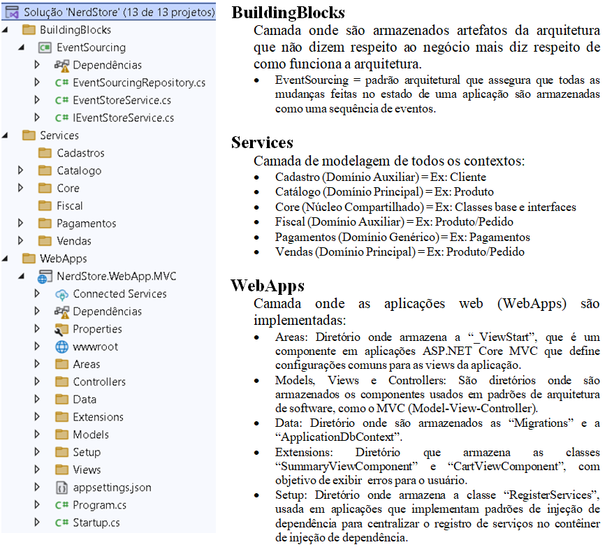

# Modelagem de Domínios Rico 

Apresentação de uma aplicação web que ilustra a aplicabilidade do DDD, com foco na aplicação prática da modelagem tática, linguagem Ubíqua e modelagem estratégica.

## 🛠️ Construído com

* [Visual Studio 2022](https://learn.microsoft.com/pt-br/visualstudio/windows/?view=vs-2022) - Ferramenta de desenvolvimento, que permite realizar todo o ciclo de desenvolvimento em um só lugar.

## 📚 Principais Bibliotecas, Frameworks e Comandos do NuGet Utilizados

* [netcoreapp2.2](https://learn.microsoft.com/pt-br/dotnet/core/whats-new/dotnet-core-2-2) - Versão específica do .NET Core, que é uma plataforma de desenvolvimento da Microsoft para criar aplicações modernas e multiplataforma. O .NET Core 2.2 foi uma das versões do .NET Core lançadas em 2018.

```
NuGet\Install-Package Microsoft.NETCore.App -Version 2.2.0
```

* [Microsoft.AspNetCore.Http](https://learn.microsoft.com/pt-br/dotnet/core/whats-new/dotnet-core-2-2) - Namespace no ASP.NET Core que fornece classes e interfaces essenciais para o trabalho com requisições HTTP (requests), respostas HTTP (responses), cookies, sessões, cabeçalhos, entre outros aspectos relacionados ao protocolo HTTP em aplicações web.

```
NuGet\Install-Package Microsoft.AspNetCore.Http -Version 2.2.0
```

* [MediatR](https://medium.com/tableless/mediatr-com-asp-net-core-7b98ba0ca640) - Padrão de projeto para promove o baixo acoplamento entre os objetos e a aplicação, permitindo que se comuniquem sem conhecer suas estruturas.

```
NuGet\Install-Package MediatR -Version 7.0.0
```

* [AutoMapper](https://automapper.org/) - Biblioteca de mapeamento de objetos facilita a conversão de dados entre objetos de tipos diferentes, evitando código repetitivo.

```
NuGet\Install-Package AutoMapper -Version 6.1.1
```

* [Microsoft.NET.Test.Sdk](https://automapper.org/) - Fornece o suporte necessário para executar testes unitários. Ele é uma parte fundamental do framework de testes para projetos que utilizam ferramentas como o xUnit, NUnit ou MSTest.

```
NuGet\Install-Package Microsoft.NET.Test.Sdk -Version 16.0.1
```

* [FluentValidation](https://docs.fluentvalidation.net/en/latest/) - Biblioteca para validação de objetos.

```
NuGet\Install-Package FluentValidation -Version 8.4.0
```

* [xunit](https://xunit.net/) - Ferramenta de teste de unidade gratuita, de código aberto e focada na comunidade para o .NET Framework.

```
NuGet\Install-Package xunit -Version 2.4.0
```

* [Microsoft.EntityFrameworkCore](https://learn.microsoft.com/pt-br/ef/core/get-started/overview/install) - ORM para interagir com bancos de dados usando objetos.

```
NuGet\Install-Package Microsoft.EntityFrameworkCore -Version 2.2.6
```

## 🚧 Descrição da Estrutura do Projeto

A estrutura do projeto segundo a imagem abaixo é composta da seguinte forma:



## ⚠️ Atenção

Destinado exclusivamente para fins de estudo.

---
⌨️ por [Byron Doria](https://gist.github.com/lohhans) 😊